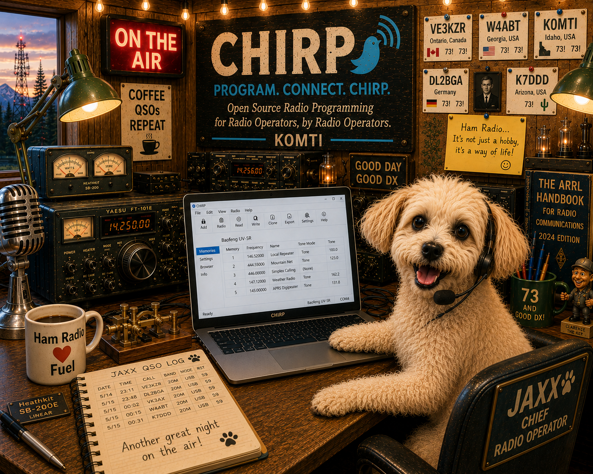
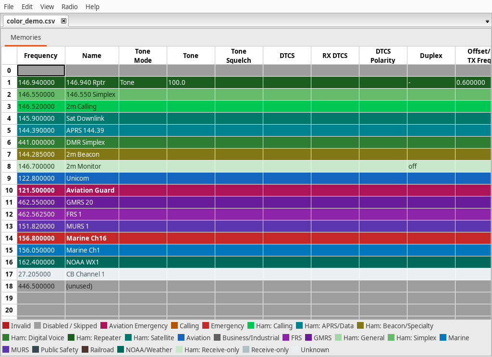
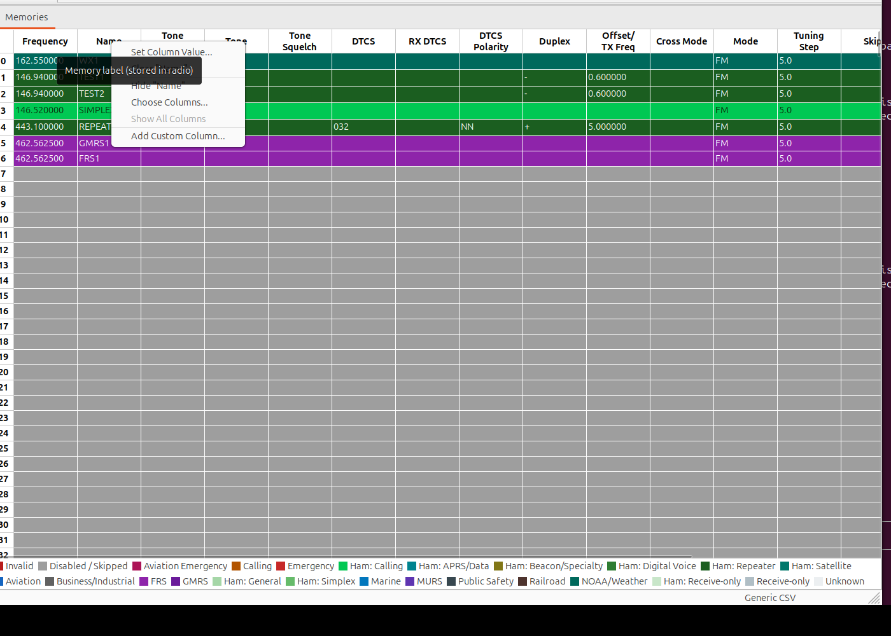
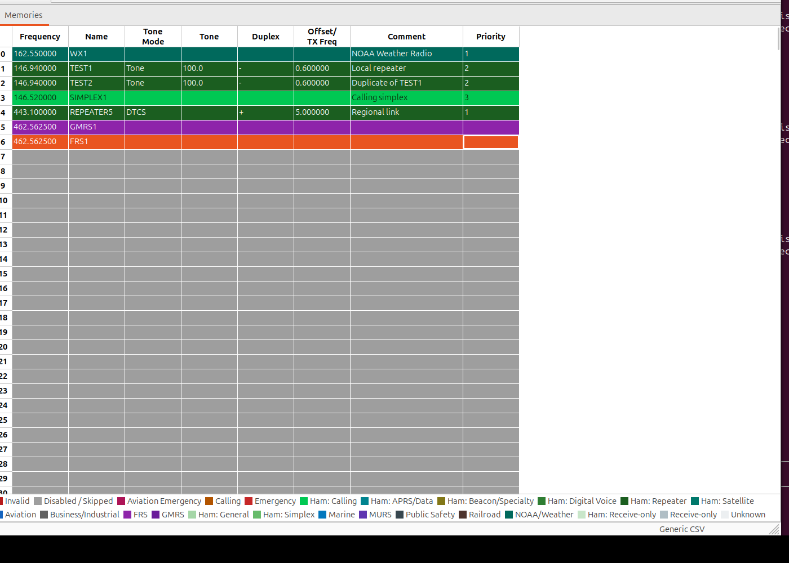
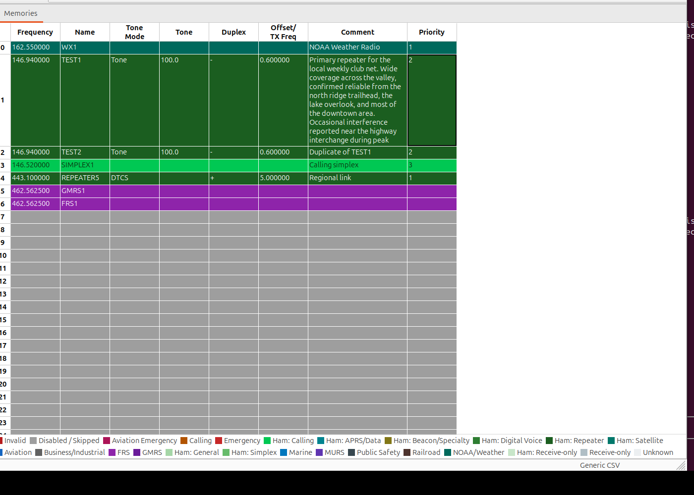
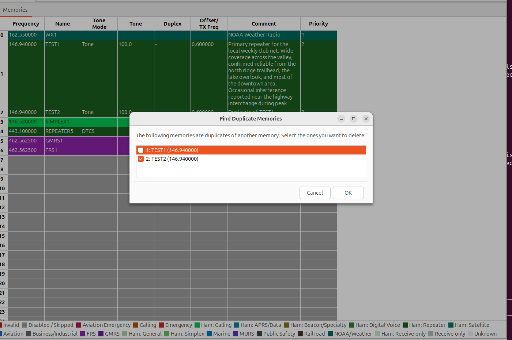
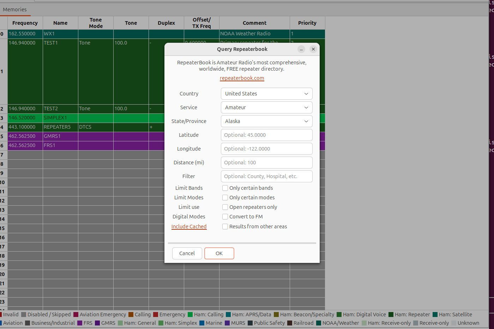
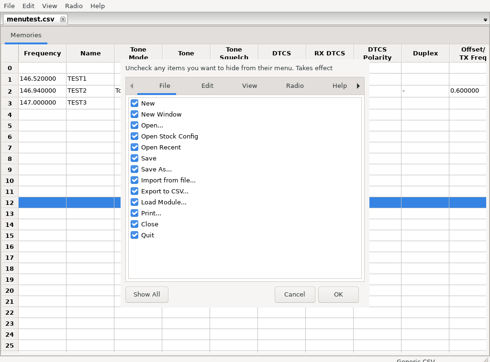
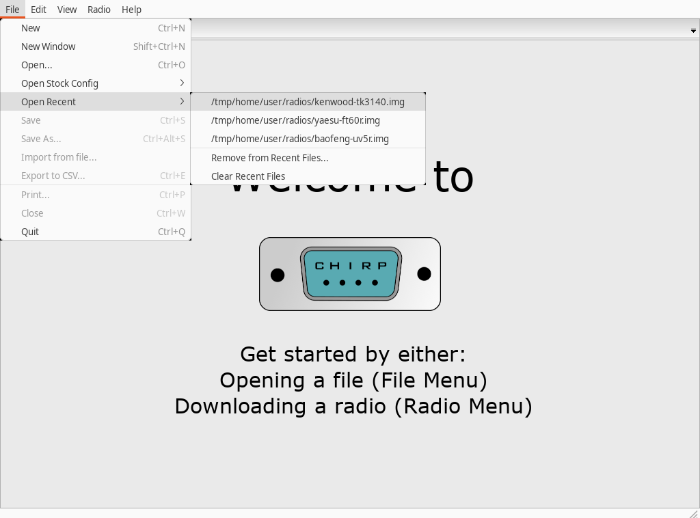
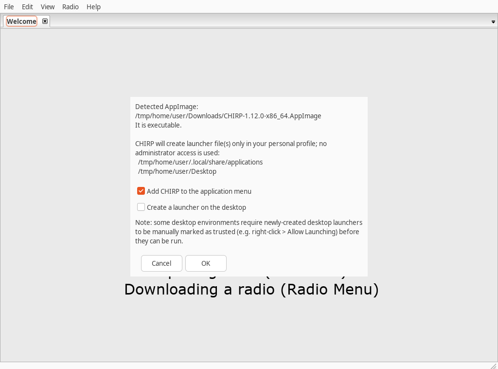

# CHIRP Project

<p align="center">
  
</p>

<p align="center">
  <a href="#linux"></a>
  <a href="#windows"></a>
  <a href="#macos"></a>
</p>

This is a fork of the official
__[CHIRP](https://www.chirpmyradio.com)__ project
([kk7ds/chirp](https://github.com/kk7ds/chirp)). Cross-platform Linux/macOS/
Windows community packages and the fork-specific features below are built
and maintained here, in
__[ddavis83864/chirp](https://github.com/ddavis83864/chirp)__ — they are
not part of, endorsed by, or supported through the upstream project. Please
report packaging or fork-specific feature issues
[here](https://github.com/ddavis83864/chirp/issues), not upstream.

When submitting PRs, please see [this file](.github/pull_request_template.md)
for rules and guidelines.

CHIRP's memory editor — this fork adds column customization, word-wrap,
duplicate detection, and configurable color coding on top of upstream CHIRP
(see [Features added in this fork](#features-added-in-this-fork) below):



## Download CHIRP

| Platform | Download | Architecture | Package | Notes |
|---|---|---|---|---|
| **Linux** | [AppImage releases](https://github.com/ddavis83864/chirp/releases?q=appimage-v&expanded=true) (current: `appimage-v1.12.0`) | x86_64 | Single-file `.AppImage` | No installation needed — `chmod +x` and run. [Instructions ↓](#linux) |
| **Windows** | [Community Edition v1.12.0](https://github.com/ddavis83864/chirp/releases/tag/windows-community-v1.12.0) | x86_64 | Portable `.zip` or `.exe` installer | **Unsigned** — SmartScreen warning expected on first run. [Instructions ↓](#windows) |
| **macOS (Apple Silicon)** | [Community Edition v1.12.0](https://github.com/ddavis83864/chirp/releases/tag/macos-community-v1.12.0) | arm64 | `.dmg` or `.app.zip` | **Unsigned** — one-time Gatekeeper bypass required. [Instructions ↓](#macos) |
| **macOS (Intel)** | [Community Edition v1.12.0](https://github.com/ddavis83864/chirp/releases/tag/macos-community-v1.12.0) | x86_64 | `.dmg` or `.app.zip` | **Unsigned** — one-time Gatekeeper bypass required. [Instructions ↓](#macos) |

Linux, macOS, and Windows releases each live in their own tag namespace
(`appimage-v<version>`, `macos-community-v<version>`,
`windows-community-v<version>`), so this table links each platform
straight to its own release rather than to a single "latest" link that
could point you at the wrong platform's build. All three v1.12.0 Community
Edition builds — Linux, macOS, and Windows — were independently verified
to be built from the exact same source commit
(`9c38424f5`); see each release's attached provenance file for details.
The macOS and Windows Community Edition releases are marked as GitHub
pre-releases, reflecting that these packaging channels are newer than the
Linux AppImage — every artifact still goes through full structural,
resource, and (for Windows) driver-registry and installer-lifecycle
validation before publishing (see the provenance manifest attached to each
release).

## Linux

**Download:** grab the latest `CHIRP-appimage-*-x86_64.AppImage` from the
[AppImage releases](https://github.com/ddavis83864/chirp/releases?q=appimage-v&expanded=true)
page — currently `appimage-v1.12.0`
([CHIRP-appimage-v1.12.0-x86_64.AppImage](https://github.com/ddavis83864/chirp/releases/tag/appimage-v1.12.0)).
x86_64 only.

```bash
chmod +x CHIRP-appimage-v1.12.0-x86_64.AppImage
./CHIRP-appimage-v1.12.0-x86_64.AppImage
```

**Desktop launcher (optional):** once CHIRP is running, Help > Install Linux
Launcher... adds it to your application menu and/or Desktop — see
[Installing a launcher](#appimage-builds) below for exact details.

**Serial port access:** on most distros your user needs to be in the
`dialout` group (or equivalent) to access `/dev/ttyUSB*`/`/dev/ttyACM*`
devices:

```bash
sudo usermod -aG dialout "$USER"
```

Sign out and back in (or reboot) for the group change to take effect. Don't
run CHIRP as root to work around a permissions issue instead.

**Troubleshooting:**

- *AppImage won't start / "Permission denied"* — you likely skipped
  `chmod +x`; re-run the command above.
- *Radio/serial device not listed* — confirm you're in the `dialout` group
  (`groups` should list it) and that you've signed out/in since adding
  yourself.
- *"Install Linux Launcher..." doesn't appear in the Help menu* — that item
  only shows when CHIRP detects it's running as an AppImage; it isn't
  available when running from a source checkout (see
  [Running from source](#running-from-source)).
- *Launcher icon won't open on double-click* — some desktop environments
  (notably GNOME/Nautilus) require a newly created desktop icon to be
  marked "Allow Launching" first (right-click it).

Prefer to run from a source checkout instead of the AppImage? See
[Running from source](#running-from-source). Full packaging details,
config isolation, and build-your-own instructions are under
[AppImage builds](#appimage-builds) below.

## Windows

CHIRP for Windows is distributed from this fork as a free, unsigned
**Community Edition** — a PyInstaller one-directory bundle, offered as
either a portable ZIP or an Inno Setup installer. It is *not* signed with
an Authenticode certificate. See
[docs/windows-community-installation.md](docs/windows-community-installation.md)
for the full walkthrough and
[packaging/windows/README.md](packaging/windows/README.md) for how it's
built and validated.

**Download:**
[CHIRP 1.12.0 for Windows — Community Edition](https://github.com/ddavis83864/chirp/releases/tag/windows-community-v1.12.0)

**Pick portable or installed:**

- **Portable** (`CHIRP-windows-v1.12.0-x86_64-portable.zip`) — extract
  anywhere and run `CHIRP.exe` directly. No installation, no
  administrator rights.
- **Installer** (`CHIRP-windows-v1.12.0-x86_64-setup.exe`) — installs
  per-user (no administrator rights required) to
  `%LOCALAPPDATA%\Programs\CHIRP`, with a Start Menu shortcut and an
  optional Desktop shortcut.

Both contain the exact same validated application bundle — pick whichever
suits you.

**First launch (SmartScreen):** because this build is unsigned, Windows
SmartScreen may block it the first time you run `CHIRP.exe` or the
installer — this is standard, expected behavior for any unsigned
application, not specific to CHIRP. If you see "Windows protected your
PC," click **More info**, then **Run anyway**. Don't disable Windows
Defender or SmartScreen system-wide to work around this — neither is
necessary, and both remove protection for your whole PC, not just this
one app.

**Verify your download (recommended):** the release page includes a
`SHA256SUMS` file. In PowerShell:

```powershell
Get-FileHash CHIRP-windows-v1.12.0-x86_64-portable.zip -Algorithm SHA256
```

Compare the printed hash against the matching line in `SHA256SUMS`. A
matching checksum confirms file integrity — that you have the exact bytes
this project's build produced — not that the software is inherently safe;
only download CHIRP from this fork's official GitHub releases page.

**USB/serial drivers:** most radio programming cables use a USB-to-serial
chip (FTDI, Prolific, or Silicon Labs CP210x are common). Windows Update
installs many of these automatically; if your cable isn't recognized, get
the driver from the cable/radio manufacturer's site or the chipset
manufacturer directly — avoid third-party driver download sites. Once
installed, the cable appears as a COM port in Device Manager; select that
port in CHIRP's Radio > Download from radio / Upload to radio dialog.

**Troubleshooting:**

- *Radio not detected* — check Device Manager for the assigned COM port,
  and make sure no other program (another CHIRP window, a terminal
  program, etc.) already has it open.
- *SmartScreen keeps reappearing* — see First launch above; this is
  expected for every unsigned build, not just the first one you download.
- *Uninstalling (installer only)* — Windows Settings > Apps > CHIRP >
  Uninstall. This removes only the installed application files; your
  saved radio images, CSV exports, and CHIRP settings are untouched.

**Prefer to run from a source checkout instead?** See
[Running from source](#running-from-source) below — useful for
development, or if you'd rather not run a downloaded binary at all.

## macOS

CHIRP for macOS is distributed from this fork as a free, unsigned
**Community Edition**. It is *not* signed with an Apple Developer ID and
has *not* been notarized by Apple. See
[docs/macos-community-installation.md](docs/macos-community-installation.md)
for the full explanation and
[docs/macos-packaging.md](docs/macos-packaging.md) for how it's built.

**Download:**
[CHIRP 1.12.0 for macOS — Community Edition](https://github.com/ddavis83864/chirp/releases/tag/macos-community-v1.12.0)

**Pick your architecture** — Apple menu (top-left) > **About This Mac**:

- **Apple Silicon** (a line labeled "Chip", e.g. Apple M1/M2/M3/M4):
  download `CHIRP-1.12.0-macOS-arm64-unsigned.dmg`
- **Intel** (a line labeled "Processor", e.g. Intel Core i5/i7):
  download `CHIRP-1.12.0-macOS-x86_64-unsigned.dmg`

A `.app.zip` of each architecture is also attached to the release as an
alternative to the `.dmg`.

**Install:**

1. Double-click the downloaded `.dmg`.
2. Drag `CHIRP.app` onto the `Applications` shortcut in the same window.
3. Eject the mounted disk image.

**First launch (Gatekeeper):** because the build is unsigned, macOS blocks
it the first time you try to open it — this is standard macOS behavior for
any application without an Apple Developer ID signature, not specific to
CHIRP.

- **Control-click method:** Finder > Applications > Control-click **CHIRP**
  > **Open** > confirm **Open** in the dialog that appears.
- **Privacy & Security method** (if Control-click doesn't offer an Open
  option): try opening CHIRP once (it will be blocked) > System Settings >
  Privacy & Security > **Open Anyway** > authenticate > try opening CHIRP
  again.

Don't disable Gatekeeper system-wide (`sudo spctl --master-disable`) or
disable System Integrity Protection to install CHIRP — neither is
necessary, and both remove security protection for your whole Mac, not
just this one app. Full step-by-step instructions, checksum verification,
and an advanced manual-quarantine-removal option are in
[docs/macos-community-installation.md](docs/macos-community-installation.md).

**USB/serial devices:** macOS includes built-in drivers for many common
USB-to-serial chips; some adapters (Prolific-based cables in particular)
may need a driver from the manufacturer. This hasn't been exhaustively
verified against every programming cable — please open an issue if a
common cable doesn't work out of the box.

## Running from source

Both launcher scripts assume you've cloned the repo:

```
git clone https://github.com/ddavis83864/chirp.git
cd chirp
```

- [`run-chirp.sh`](run-chirp.sh) (Linux): creates a local `.venv` (with
  access to system wxPython) on first run and installs CHIRP into it, then
  launches `chirpwx.py`.
- [`run-chirp.ps1`](run-chirp.ps1) (Windows): creates a `.venv` using Python
  3.11 (the version wxPython 4.2.x ships prebuilt wheels for), installs
  `requirements.txt` (wxPython separately, wheel-only, so pip never tries to
  compile it), then launches `chirpwx.py`. Supports `-Cli` to launch `chirpc`
  instead, and `-Reinstall` to rebuild the venv from scratch.

## Features added in this fork

On top of upstream CHIRP, this fork adds several memory-editor
quality-of-life features, plus a convenience launcher script and Linux
AppImage packaging (see below).

### Column hiding, reordering, and custom columns

Right-click any memory list column header (or use View > Choose Columns...)
to hide columns you don't care about, or show columns that were previously
hidden. Columns can also be reordered by dragging their headers. Both the
hidden set and the order persist across sessions.

You can also add your own scratch column (View > Add Custom Column..., or
the header right-click menu) for personal notes, sorting, or triage — it's
session-only: not saved to the radio or the file, not validated, and not
part of undo. It disappears when the tab is closed.





### Word-wrapped Comment column

The Comment column wraps long text across multiple lines instead of
scrolling off as one long line, both when viewing and when editing in place
(View > Word-wrap Comment column to toggle). Rows grow individually to fit
their own comment.



### Insert multiple rows at once

Right-click a memory row and choose Insert Rows Above... to insert more than
one blank row in a single action — you're prompted for how many, instead of
always getting exactly one. Inserting 5 rows is tracked as a single undo
step, same as inserting 1.


### Find Duplicate Memories

Edit > Find Duplicate Memories... lets you choose which fields (frequency,
tone, offset, etc.) define a "duplicate," then shows the matching groups so
you can delete them — defaulting to keeping the lowest-numbered memory in
each group.



### Option to paste incompatible memories anyway

Pasting or drag-importing memories that don't fit the destination radio (an
out-of-band frequency, an unsupported mode/tone/duplex, etc.) used to be
silently rejected, with only an after-the-fact notice listing what didn't
make it in. You're now asked "N memories failed validation for this radio
... Add them anyway?" — choosing Yes pastes them in as-is despite the
validation failure; choosing No preserves the old behavior.


### Editable, savable network query results

Memories downloaded from a query source (RepeaterBook, RadioReference,
DMR-MARC, przemienniki.net/eu, mapy73.pl, Radio Amateur Satellites, SatNOGS)
used to be read-only with no way to save them — the only workaround was
exporting to CSV and reopening that file. They're now editable directly in
the grid, and saving an unsaved query result prompts for a CSV filename and
transparently swaps the tab to the newly-saved file.

### RepeaterBook distance in miles

The RepeaterBook query dialog's Distance field is now in miles (matching
RepeaterBook.com's own site and most of its US/Canada audience) instead of
kilometers; it's converted internally as needed. Other query sources
(przemienniki.net/eu) keep their km-based distance field.



### Manual "Check for Updates" instead of automatic

CHIRP used to check chirpmyradio.com for a newer version automatically at
every startup. This fork removes that automatic check entirely — use
Help > Check for Updates... to check on demand instead. Unlike the old
automatic check, the manual one always tells you something: a "new version
available" prompt, or an explicit "you're running the latest version"
message if there's nothing new.


### Customize Menus

Help > Customize Menus... opens a tabbed dialog — one tab per top menu
(File, Edit, View, Radio, Help) plus a "Memory list (right-click)" tab for
the memory grid's context menu. Uncheck anything you never use to hide it;
changes take effect immediately, and a "Show All" button resets everything
back. Hidden items are remembered across restarts. Undo/Redo and the
Customize Menus item itself are always shown, since they're not worth the
edge cases of hiding.



### Open Recent cleanup

File > Open Recent now has "Remove from Recent Files..." and "Clear Recent
Files" at the bottom of the list. "Remove from Recent Files..." opens a
checklist of your current recent files so you can pick specific ones to
drop; "Clear Recent Files" empties the whole list in one click. Both are
only shown when the list has entries.



### Configurable memory color coding

The memory list can color-code rows (or just selected columns) by what a
memory is: amateur repeater vs. simplex vs. calling frequency, GMRS, FRS,
MURS, marine, aviation, railroad, public safety, business/industrial,
NOAA weather, and more, plus operational states like disabled/skipped,
receive-only, and (optionally) invalid. It's on by default; everything
about it lives under View > Customize Colors... and View > Enable Memory
Color Coding / Show Color Legend.

Amateur-radio memories get finer-grained categories than a single "ham"
color: repeater, simplex, national/regional calling frequency, satellite,
APRS/data, digital voice (DMR/D-STAR/System Fusion/P25), propagation
beacon/weak-signal specialty, receive-only, and general/unclassified.
Repeater vs. simplex is determined from duplex/offset, not from whether a
tone is set, so a repeater with no tone configured still shows as a
repeater. Classification follows a fixed precedence — invalid (opt-in) >
disabled/skipped > your custom rules > emergency/calling >
specialized amateur operation > plain service membership > receive-only >
unknown — so a given memory's color is always deterministic and
explainable.

Every category's colors (background, text, bold, enabled/disabled) are
yours to change, and you can add your own rules matching frequency,
service, duplex, mode, tone, name, comment, skip state, and more, each
with its own color and priority. Color profiles export/import as JSON for
sharing or backup. Nothing about this feature is written into radio
memories, image files, CSV exports, or uploaded to a radio — it's
CHIRP-local display metadata only.

These categories are a visual convenience aid, not a legal or regulatory
determination — frequency allocations vary by country, licensing class, and
local band plan, and change over time. You remain responsible for
verifying your own frequencies and operating privileges.

(See the color-coded memory list screenshot at the top of this README.)

### Programming Assistant (Experimental)

Disabled by default — enable it from Help > Enable Programming
Assistant (Experimental) and restart CHIRP, then use Radio > Programming
Assistant... Turns a description of what you want
programmed — structured fields, or an optional AI-interpreted plain-text
description like "I live near Coeur d'Alene, I fly GA, I camp, I have a
GMRS license and a Technician license" — into a previewed, editable batch
of proposed memories. Every proposed channel is converted and validated
through CHIRP's own import/validation logic for the radio you have open,
and nothing is written until you review and approve it; applying a plan
is one undoable action on the open image only — it never uploads to a
radio. AI, when configured, only ever extracts structured fields from
your text; it never supplies frequencies, tones, or any other technical
data. Aviation, weather, marine, public safety, business, and railroad
channels are always receive-only. See
[docs/programming_assistant.md](docs/programming_assistant.md) for full
details, data sources, privacy behavior, and known limitations.

## AppImage builds

This fork can produce a self-contained Linux AppImage of CHIRP, so people
with access to this repo can run it without setting up a Python/wxPython
build environment themselves.

**Getting a build:** every push of an `appimage-vX.Y.Z` tag (e.g.
`appimage-v1.12.0`) triggers the
[AppImage workflow](.github/workflows/appimage.yml), which builds the
AppImage and attaches it to a matching
[GitHub Release](https://github.com/ddavis83864/chirp/releases?q=appimage-v&expanded=true)
on this repo. Download the `CHIRP-*-x86_64.AppImage` asset from there,
`chmod +x` it, and run it. Releases follow semantic versioning — see
[CHANGELOG.md](CHANGELOG.md) for what changed in each one and what the
version numbers mean.

**Config is isolated from other CHIRP installs:** by default CHIRP stores
its settings in `~/.chirp`, shared by any install on the host (native
package, source checkout, another AppImage, etc.) — so a setting like
Help > Developer Mode enabled in one carries straight over to the others.
This AppImage instead defaults to its own `~/.chirp-appimage`, so it always
starts from CHIRP's real defaults (developer mode off, no "Browser"/"Info"
tabs) regardless of what's already set elsewhere on the host. Pass
`--config-dir /path` yourself if you want it to share state with another
install instead.

**Installing a launcher:** since an AppImage is just a standalone
executable file, your desktop environment won't normally know about it —
there's no menu entry or icon to launch it from without a terminal or file
browser. Help > Install Linux Launcher... (only shown when CHIRP detects
it's running as an AppImage, via the `APPIMAGE` environment variable the
AppImage runtime sets) fixes that:

- It first checks that the AppImage file has execute permission, and
  offers to add it (only the owner-execute bit; nothing else is touched)
  if it's missing.
- You then choose to add CHIRP to your desktop environment's application
  menu, create a launcher icon on your Desktop, or both. Both are entirely
  per-user: the application-menu entry goes to
  `~/.local/share/applications/chirp-appimage.desktop`, and CHIRP's icon is
  copied to `~/.local/share/icons/hicolor/256x256/apps/chirp.png` — no
  administrator/root access is used, and nothing outside your home
  directory is touched.
- If you later move the AppImage file, just run Help > Install Linux
  Launcher... again from the new location to update the existing launcher
  in place; it recognizes and safely updates its own previously-created
  files rather than making duplicates, and never overwrites a file it
  didn't create itself.
- Some desktop environments (notably GNOME/Nautilus) require a
  newly-created desktop icon to be manually marked as trusted (e.g.
  right-click it and choose "Allow Launching") before it can be
  double-clicked; the application-menu entry doesn't need this.
- To remove a launcher created this way, delete
  `~/.local/share/applications/chirp-appimage.desktop` and/or
  `~/Desktop/chirp-appimage.desktop`; the copied icon at
  `~/.local/share/icons/hicolor/256x256/apps/chirp.png` can be removed the
  same way if no other CHIRP install needs it.



**Building one yourself:**

```
./appimage/build.sh
```

This must run on an x86_64 Ubuntu 22.04 (jammy) host — a real machine, VM,
or a `ubuntu:22.04` Docker container all work. It installs its own build
dependencies (via `sudo apt-get`) and writes the result to
`appimage/out/CHIRP-<version>-x86_64.AppImage`. You can also trigger a build
without tagging anything, via "Run workflow" on the
[Actions tab](../../actions/workflows/appimage.yml) (`workflow_dispatch`).

**Why it needs Ubuntu 22.04 specifically, and how it's built:** wxPython has
no portable Linux wheel on PyPI, so the recipe
([`appimage/AppImageBuilder.yml`](appimage/AppImageBuilder.yml), built with
[`appimage-builder`](https://appimage-builder.readthedocs.io/)) pulls
`python3-wxgtk4.0` and the GTK3 stack it depends on straight from Ubuntu
22.04's apt repositories, bundling them into the AppImage. CHIRP itself and
its pure-Python dependencies (`pyserial`, `requests`, `yattag`, `suds`,
`lark`) are then `pip install`ed on top into the same bundle, and
translations are compiled from `chirp/locale/*.po` directly into the
bundle (a step `pip install` alone skips, since it normally happens via
`chirp/locale/Makefile`).

This setup was built and verified end-to-end in a disposable Ubuntu 22.04
container: the resulting AppImage was launched under a virtual display
(Xvfb) and confirmed to fully initialize CHIRP's wx GUI
(`wx/4.0.7 gtk3 (phoenix) wxWidgets 3.0.5`), open its main window, check for
updates, and load a non-English translation correctly. A handful of shared
libraries (`libwayland-cursor0`, `libwayland-client0`, `libwayland-egl1`,
`libxcb-render0`) and build-time helper tools
(`gdk-pixbuf-query-loaders`, `glib-compile-schemas`, `gtk-update-icon-cache`)
had to be added explicitly, since apt's automatic dependency resolution
didn't pull them in on its own.

**Known limitations:** the build is x86_64-only and pinned to Ubuntu 22.04's
package versions (wxPython 4.0.7 / wxWidgets 3.0.5, GTK3). It has not been
tested on other architectures or against a Wayland compositor without the
X11 backend CHIRP forces by default on Linux.

## Documentation

- [docs/screenshots.md](docs/screenshots.md) — inventory of every
  screenshot used in this README and the docs, with the app version,
  platform, and capture context each one was taken from.
- [docs/macos-community-installation.md](docs/macos-community-installation.md) —
  full macOS Community Edition install and Gatekeeper walkthrough.
- [docs/macos-packaging.md](docs/macos-packaging.md) — how the macOS
  Community Edition and (future) Signed Edition builds are packaged and
  released.
- [docs/windows-community-installation.md](docs/windows-community-installation.md) —
  full Windows Community Edition install guide (portable ZIP and
  installer, SmartScreen guidance, checksum verification).
- [packaging/windows/README.md](packaging/windows/README.md) — how the
  Windows Community Edition build (portable ZIP + installer) is packaged,
  tested, and validated.
- [docs/windows-manual-validation-checklist.md](docs/windows-manual-validation-checklist.md) —
  manual, real-hardware validation checklist used for Windows releases.
- [docs/programming_assistant.md](docs/programming_assistant.md) — the
  experimental Programming Assistant feature: data sources, privacy
  behavior, and known limitations.
- [CHANGELOG.md](CHANGELOG.md) — what changed in each release and what the
  version numbers mean.
